# PyTorch implementation of DreamerV3

PyTorch implementation of DreamerV3, [Mastering Diverse Domains through World Models](https://arxiv.org/abs/2301.04104). 


## Installation

Clone GitHub repository and set up environment
```
git clone https://github.com/burchim/DreamerV3-PyTorch.git && cd DreamerV3-PyTorch
pip install -r requirements.txt
```

## Training

Train agent on a specific task:
```
env_name=dmc-Acrobot-swingup python3 main.py -c configs/DreamerV3/dreamer_v3.py
```

Train agent on all tasks:
```
./train_dreamerv3_dmc.sh
./train_dreamerv3_atari100k.sh
```

Visualize experiments
```
tensorboard --logdir ./callbacks
```

Overriding model config hyperparameters
```
override_config='{"num_envs": 4, "eval_episode_saving_path": "./videos"}' env_name=dmc-Acrobot-swingup python3 main.py -c configs/DreamerV3/dreamer_v3.py
```

## Evaluation

```
env_name=dmc-Acrobot-swingup python3 main.py -c configs/DreamerV3/dreamer_v3.py --mode evaluation
```

## Results

### Visual Deep Mind Control Scores (1M env steps)

#### Scores

| Task    | Score |
| -------- | ------- |
| Env Steps | 1M |
| Num envs | 1 |
| Acrobot Swingup | 458.7 | 
| Cartpole Balance | 996.7 | 
| Cartpole Balance Sparse | 1000.0 | 
| Cartpole Swingup | 860.7 |
| Cartpole Swingup Sparse | 844.2 | 
| Cheetah Run | 860.6 |
| Cup Catch | 966.2 |
| Finger Spin | 427.6 |
| Finger Turn Easy | 794.7 |
| Finger Turn Hard | 856.7 |
| Hopper Hop | 294.4 |
| Hopper Stand | 912.1 |
| Pendulum Swingup | 784.9 |
| Quadruped Run | 818.2 | 
| Quadruped Walk | 892.8 |
| Reacher Easy | 887.0 |
| Reacher Hard | 461.2 |
| Walker Run | 683.8 |
| Walker Stand | 983.4 |
| Walker Walk | 961.7 |
| Median | 858.7 | 
| Mean | 787.3 | 

#### Figures

  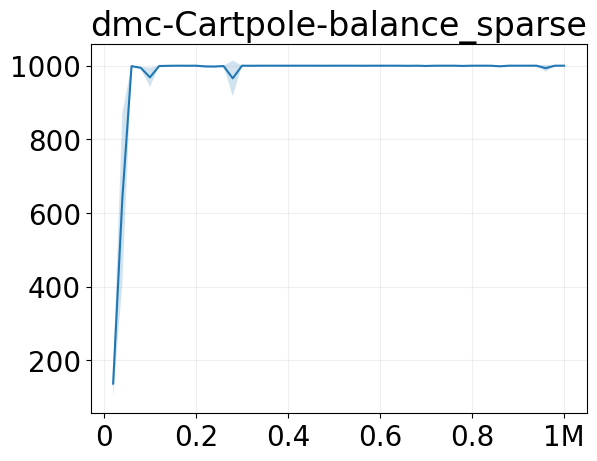   

   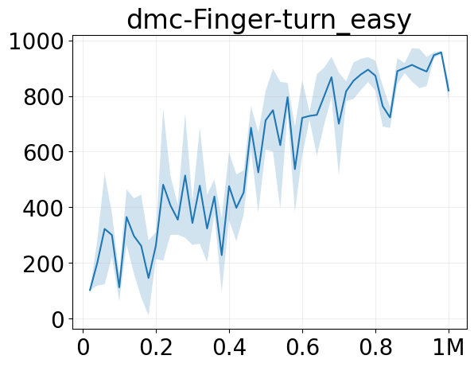  

 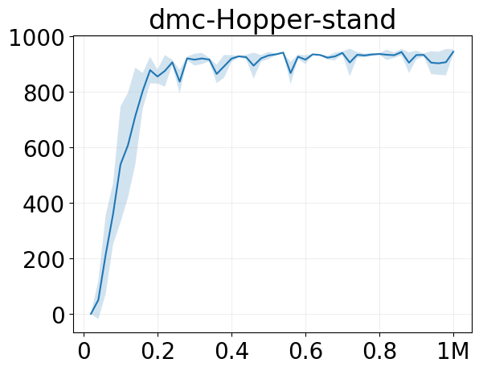   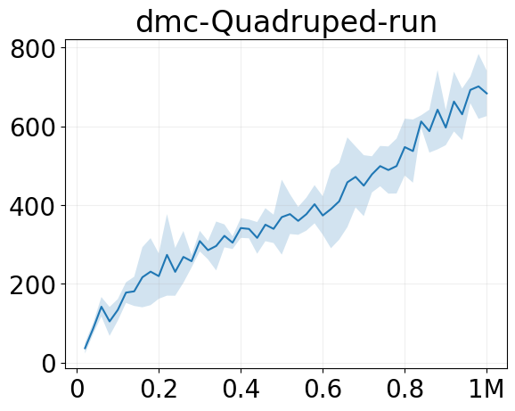 

  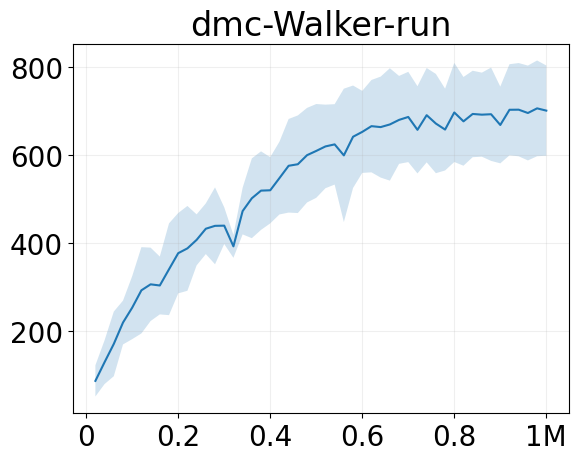  

 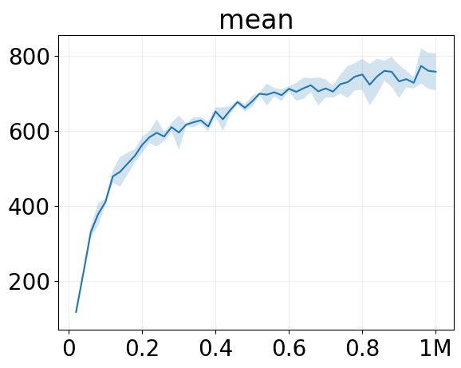

### Visual Deep Mind Control Scores (5M env steps)

#### Scores

| Task    | Score |
| -------- | ------- |
| Env Steps | 5M |
| Num envs | 4 |
| Acrobot Swingup | 411.2 | 
| Cartpole Balance | 999.2 | 
| Cartpole Balance Sparse | 1000.0 | 
| Cartpole Swingup | 866.7 |
| Cartpole Swingup Sparse | 841.2 | 
| Cheetah Run | 916.1 |
| Cup Catch | 967.5 |
| Finger Spin | 388.9 |
| Finger Turn Easy | 823.3 |
| Finger Turn Hard | 896.6 |
| Hopper Hop | 640.2 |
| Hopper Stand | 942.9 |
| Pendulum Swingup | 793.6 |
| Quadruped Run | 918.2 | 
| Quadruped Walk | 940.7 |
| Reacher Easy | 972.9 |
| Reacher Hard | 974.9 |
| Walker Run | 827.0 |
| Walker Stand | 986.0 |
| Walker Walk | 973.3 |
| Median | 917.2 | 
| Mean | 854.0 | 

#### Figures

     

     

     

    

 

### Atari 100k Scores (400k env steps)

#### Scores

| Task    | Random | Human | Score |
| -------- | ------- | ------- | ------- |
| Env Steps | - | - | 400K |
| Num envs | - | - | 1 |
| Alien | 228 | 7128 | 986.0 | 
| Amidar | 6 | 1720 | 142.6 | 
| Assault | 222 | 742 | 683.2 | 
| Asterix | 210 | 8503 | 1045.0 | 
| Bank Heist | 14 | 753 | 979.0 | 
| Battle Zone | 2360 | 37188 | 15400.0 | 
| Boxing | 0 | 12 | 70.6 | 
| Breakout | 2 | 30 | 19.7 | 
| Chopper Com. | 811 | 7388 | 1250.0 | 
| Crazy Climber | 10780 | 35829 | 91300.0 | 
| Demon Attack | 152 | 1971 | 375.0 | 
| Freeway | 0 | 30 | 21.7 | 
| Frostbite | 65 | 4335 | 2300.0 | 
| Gopher | 258 | 2412 | 3962.0 | 
| Hero | 1027 | 30826 | 13541.5 | 
| James Bond | 29 | 303 | 325.0 | 
| Kangaroo | 52 | 3035 | 5760.0 | 
| Krull | 1598 | 2666 | 6320.0 | 
| Kung Fu Master | 258 | 22736 | 27250.0 | 
| Ms Pacman | 307 | 6952 | 2781.0 | 
| Pong | –21 | 15 | 18.3 | 
| Private Eye | 25 | 69571 | 15170.0 |  
| Qbert | 164 | 13455 | 3322.5 | 
| Road Runner | 12 | 7845 | 10680.0 |  
| Seaquest | 68 | 42055 | 546.0 | 
| Up N Down | 533 | 11693 | 6040.0 |
| Human Median | 0% | 100% | 57.7% |
| Human Mean | 0% | 100% | 114.2% |

#### Figures

     

 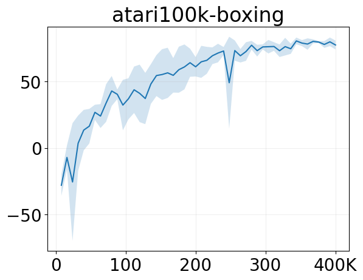    

     

  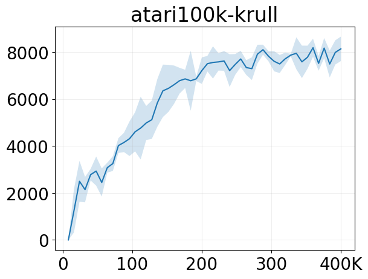  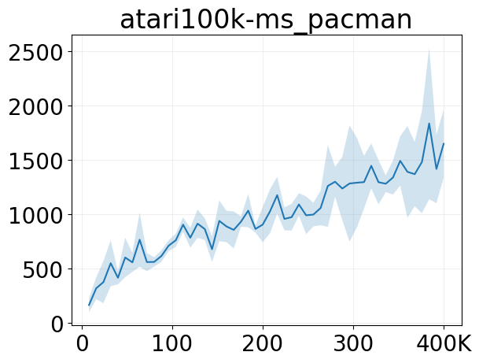 

   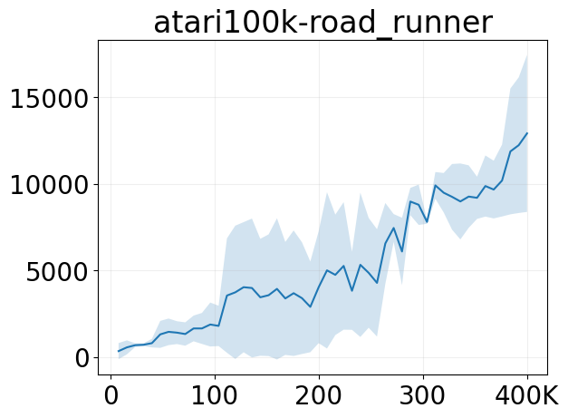 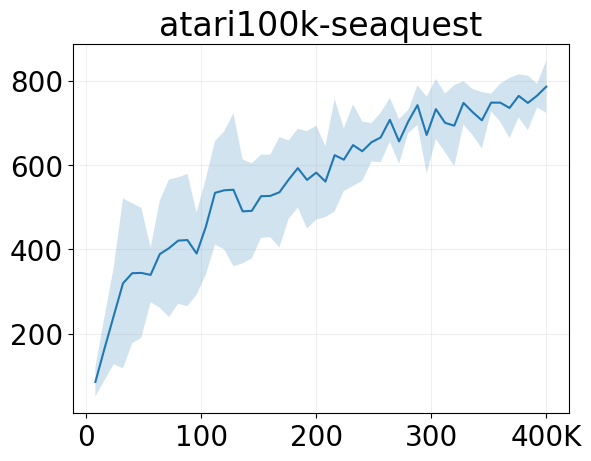

  

### Atari Scores (200M env steps)

#### Scores

| Task    | Random | Human | Record | Score |
| -------- | ------- | ------- | ------- | ------- |
| Env Steps | - | - | - | 200M |
| Num envs | - | - | - | 8 |
| Breakout | 2 | 30 | 864 | 370.5 |
| Montezuma Revenge | 0 | 4753 | 1219200 | 2520 |

#### Figures

 

## Acknowledgments

Official DreamerV3 Implementation: [https://github.com/danijar/dreamerv3](https://github.com/danijar/dreamerv3)