# PyTorch implementation of DreamerV3

PyTorch implementation of DreamerV3, [Mastering Diverse Domains through World Models](https://arxiv.org/abs/2301.04104). 


## Installation

Clone GitHub repository and set up environment
```
git clone https://github.com/burchim/DreamerV3-PyTorch.git && cd DreamerV3-PyTorch
pip install -r requirements.txt
```

## Training

Train agent on a specific task:
```
env_name=dmc-Acrobot-swingup python3 main.py -c configs/DreamerV3/dreamer_v3.py
```

Train agent on all tasks:
```
./train_dreamerv3_dmc.sh
./train_dreamerv3_atari100k.sh
```

Visualize experiments
```
tensorboard --logdir ./callbacks
```

Overriding model config hyperparameters
```
override_config='{"num_envs": 4, "eval_episode_saving_path": "./videos"}' env_name=dmc-Acrobot-swingup python3 main.py -c configs/DreamerV3/dreamer_v3.py
```

## Evaluation

```
env_name=dmc-Acrobot-swingup python3 main.py -c configs/DreamerV3/dreamer_v3.py --mode evaluation
```

## Results

### Visual Deep Mind Control Scores (1M env steps)

We averaged the evaluation score over 10 episodes and used 3 seeds per experiment.

#### Scores

| Task    | DreamerV3 | DreamerV3-PyTorch (this repo) |
| -------- | ------- | ------- |
| Env Steps | 1M | 1M |
| Acrobot Swingup | 210.0 | 410.8 |
| Cartpole Balance | 996.4 | 999.3 |
| Cartpole Balance Sparse | 1000.0 | 1000.0 |
| Cartpole Swingup | 819.1 | 865.1 |
| Cartpole Swingup Sparse | 792.9 | 525.6 |
| Cheetah Run | 728.7 | 886.6 |
| Cup Catch | 957.1 | 741.1 |
| Finger Spin | 818.5 | 547.6 |
| Finger Turn Easy | 787.7 | 819.4 |
| Finger Turn Hard | 810.8 | 832.2 |
| Hopper Hop | 369.6 | 369.7 |
| Hopper Stand | 900.6 | 944.6 |
| Pendulum Swingup | 806.3 | 791.8 |
| Quadruped Run |352.3 | 683.7 |
| Quadruped Walk | 352.6 | 733.4 |
| Reacher Easy | 898.9 | 831.5 |
| Reacher Hard | 499.2 | 597.2 |
| Walker Run | 757.8 | 701.1 |
| Walker Stand | 976.7 | 900.0 |
| Walker Walk | 955.8 | 956.0 |
| Mean | 739.6 | 756.8 |
| Median | 808.5 | 814.0 |

#### Figures

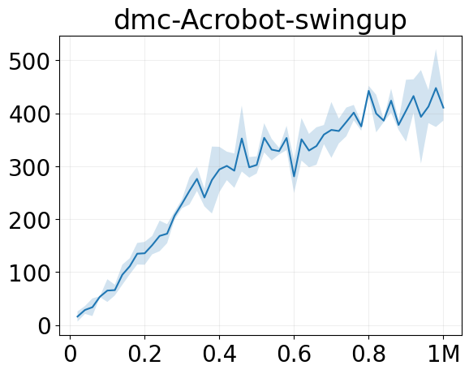 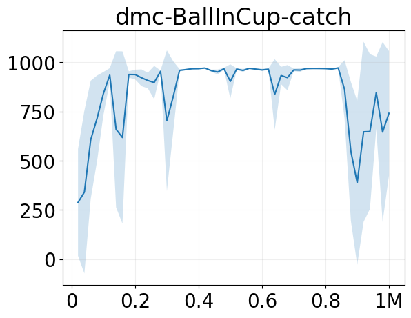  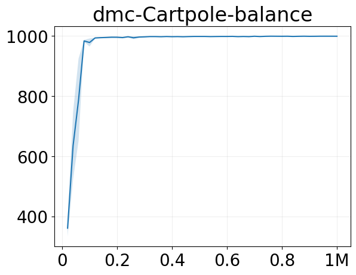  

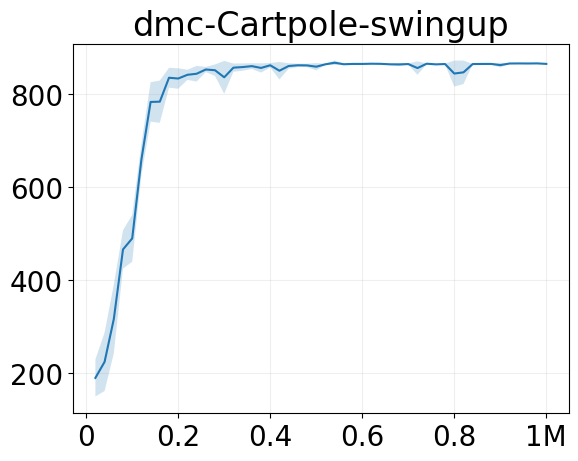 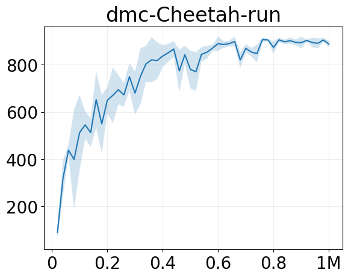   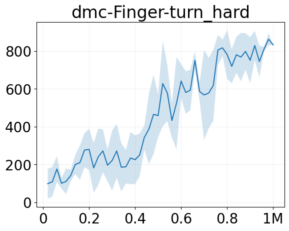 

     

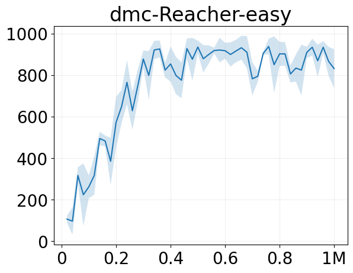    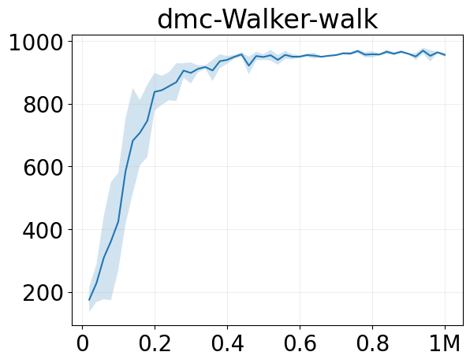

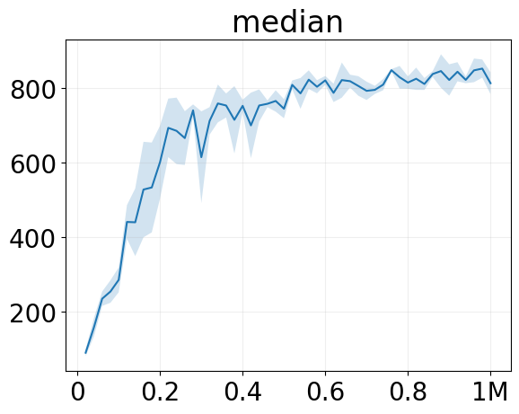 

### Atari 100k Scores (400k env steps)

We averaged the evaluation score over 10 episodes and used 3 seeds per experiment.

#### Scores

| Task    | Random | Human | DreamerV3 | DreamerV3-PyTorch (this repo)  |
| -------- | ------- | ------- | ------- | ------- |
| Env Steps | - | - | 400K | 400K |
| Alien | 228 | 7128 | 959 | 1093 |
| Amidar | 6 | 1720 | 139 | 115 |
| Assault | 222 | 742 | 706 | 604 |
| Asterix | 210 | 8503 | 932 | 1500 |
| Bank Heist | 14 | 753 | 649 | 639 |
| Battle Zone | 2360 | 37188 | 12250 | 13867 |
| Boxing | 0 | 12 | 78 | 78 |
| Breakout | 2 | 30 | 31 | 65 |
| Chopper Com. | 811 | 7388 | 420 | 1127 |
| Crazy Climber | 10780 | 35829 | 97190 | 79647 |
| Demon Attack | 152 | 1971 | 303 | 233 |
| Freeway | 0 | 30 | 0 | 10 |
| Frostbite | 65 | 4335 | 909 | 364 |
| Gopher | 258 | 2412 | 3730 | 3285 |
| Hero | 1027 | 30826 | 11161 | 9610 |
| James Bond | 29 | 303 | 445 | 655 |
| Kangaroo | 52 | 3035 | 4098 | 4120 |
| Krull | 1598 | 2666 | 7782 | 8144 |
| Kung Fu Master | 258 | 22736 | 21420 | 26047 |
| Ms Pacman | 307 | 6952 | 1327 | 1649 |
| Pong | –21 | 15 | 18 | 20 |
| Private Eye | 25 | 69571 | 882 | 1141 |
| Qbert | 164 | 13455 | 3405 | 1978 |
| Road Runner | 12 | 7845 | 15565 | 12913 |
| Seaquest | 68 | 42055 | 618 | 786 |
| Up N Down | 533 | 11693 | 7600 | 14986 |
| Human Mean | 0% | 100% | 112% | 120% |
| Human Median | 0% | 100% | 49% | 44% |

#### Figures

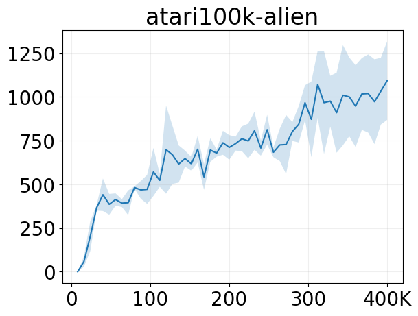  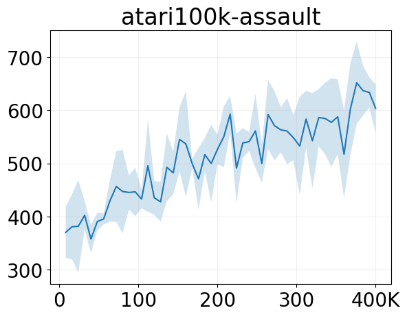   

     

  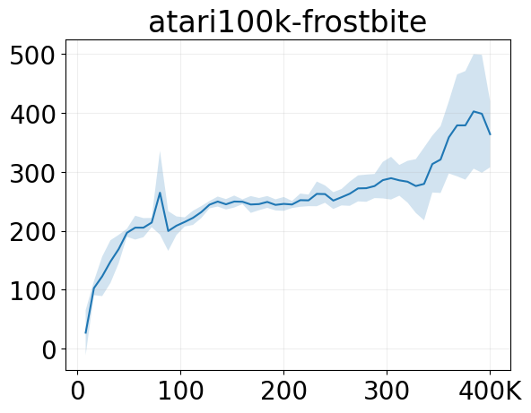 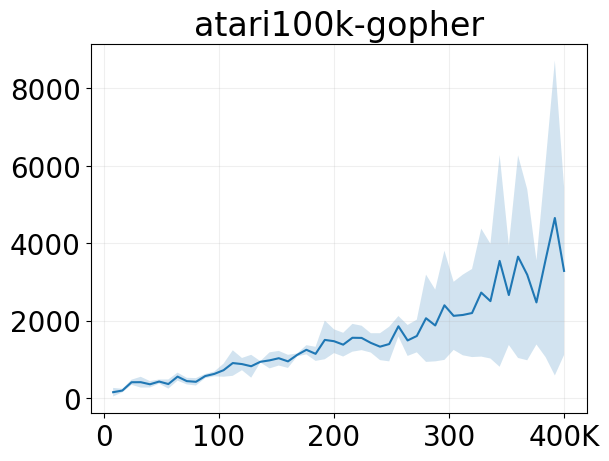  

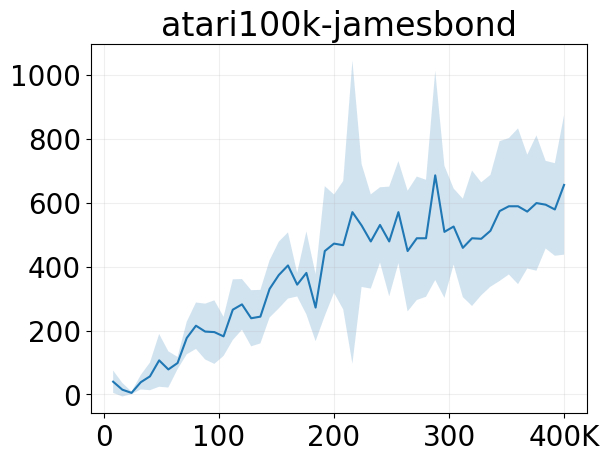 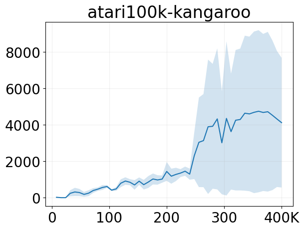    

 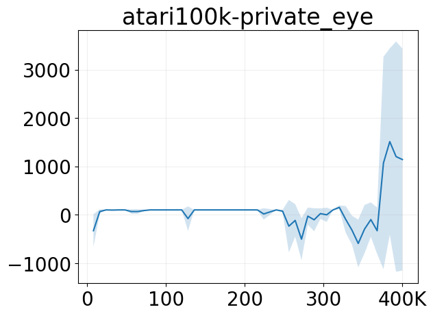   

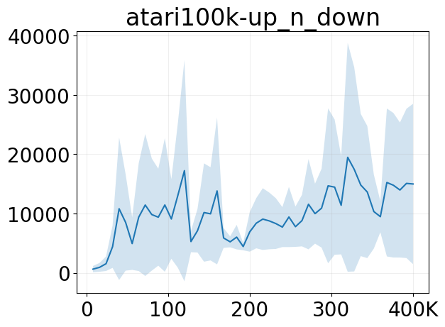  

## Acknowledgments

Official DreamerV3 Implementation: [https://github.com/danijar/dreamerv3](https://github.com/danijar/dreamerv3)